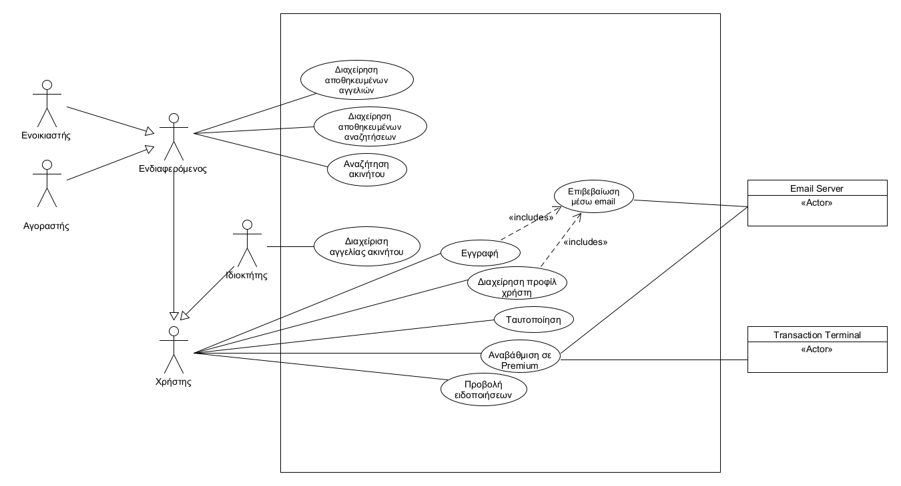

# INF138 Project Template

Ένα απλό πρότυπο οργάνωσης του κώδικα και της τεχνικής τεκμηρίωσης για τις εξαμηνιαίες εργασίες του μαθήματος Τεχνολογία Λογισμικού ([INF138](https://eclass.aueb.gr/courses/INF138/)) του Τμήματος Πληροφορικής Οικονομικού Πανεπιστημίου Αθηνών.

Η τρέχουσα έκδοση περιλαμβάνει την [προδιαγραφή των απαιτήσεων λογισμικού](docs/markdown/software-requirements.md) με προσαρμογή του `IEEE Std 830-1998` για την ενσωμάτωση απαιτήσεων σε μορφή περιπτώσεων χρήσης. Για περισσότερες λεπτομέρειες μπορείτε να ανατρέξετε στο βιβλίο [Μ Γιακουμάκης, Ν. Διαμαντίδης, Τεχνολογία Λογισμικού, Σταμούλης, 2009](https://www.softeng.gr).

# Οδηγίες χρήσης

Στην παρούσα αρχική σελίδα `README.md` προσθέστε σε μορφή Markdown την περιγραφή του Project όπως σας ζητείται στο παραδοτέο R1. Στη σελίδα αυτή θα προστεθούν σύνδεσμοι προς τα έγγραφα Markdown που περιλαμβάνουν την προδιαγραφή και ανάλυση των απαιτήσεων [software-requirements.md](docs/markdown/software-requirements.md) και τη σχεδίαση του συστήματος [design.md](docs/markdown/design.md).

Η τεκμηρίωση/διαγράμματα που ζητούνται στα επόμενα παραδοτέα θα τοποθετηθούν στους εξής φακέλους:
* `docs/markdown`: αρχεία Markdown με την τεκμηρίωση του συστήματος που απαιτείται για τα παραδοτέα R2-R4. H τεκμηρίωση θα συμπεριληφθεί στα ακόλουθα αρχεία:
     *  `software-requirements.md`: προδιαγραφή και ανάλυση των απαιτήσεων. Προκειμένου να διευκολυνθεί η συνεργασία σας, οι περιγραφές των περιπτώσεων χρήσης μπορούν να εισαχθούν σε διαφορετικά αρχεία `*.md`. Προϋπόθεση είναι να υπάρχουν κατάλληλοι σύνδεσμοι από το `software-requirements.md` προς αυτά έτσι ώστε να διευκολύνεται η πλοήγηση στην τεκμηρίωση μέσω του Gitlab. Τα διαγράμματα που θα δημιουργηθούν στα πλαίσια του R2 θα ενσωματωθούν στα παραπάνω έγγραφα (δεν θα λάβουμε υπόψιν διαγράμματα με μορφή εικόνας/uxf που δεν θα φαίνονται ως μέρος της τεκμηρίωσης).
     *  `design.md`: περιγραφή της σχεδίασης του συστήματος όπως ζητείται στα παραδοτέα R3 και R4. To έγγραφο θα ενσωματώνει όλα τα διαγράμματα που θα δημιουργηθούν στα παραδοτέα R3, R4. Οι εικόνες των διαγραμμάτων θα είναι διαθέσιμες στο φάκελο `docs/markdown/uml`, όπως παράγονται από το εργαλείο Gradle.
* `docs/uml`: αρχεία Umlet (`*.uxf`) με τα διαγράμματα που έχουν υλοποιηθεί στα πλαίσια των παραδοτέων R2-R4. Μπορούν να οργανωθούν σε υποφακέλους (πχ. `requirements`, `design`).

Η αυτοματοποιημένη μετατροπή των διαγραμμάτων Umlet σε PNG εικόνες, έτοιμες προς ενσωμάτωση στην Markdown τεκμηρίωσή σας μπορεί να γίνει με χρήση του εργαλείου Gradle. Προϋπόθεση για τη σωστή λειτουργία της διαδικασίας είναι η [λήψη](https://maven.apache.org/download.cgi), [εγκατάσταση](https://maven.apache.org/install.html) και προσθήκη στο PATH του συστήματος του εργαλείου Maven.

Μετά την εγκατάσταση του Maven, μπορείτε να παράξετε όλα τα διαγράμματα που βρίσκονται στον κατάλογο `docs\uml` (και υποκαταλόγους) με τη βοήθεια του Gradle (δε χρειάζεται εγκατάσταση):

Από γραμμή εντολών Windows:
```bash
gradlew.bat umlet
```

Από γραμμή εντολών Linux:
```bash
./gradlew umlet
```

Η εκτέλεση της εντολής θα εγκαταστήσει το Gradle και θα παράξει τα διαγράμματα στον κατάλογο `docs\markdown\uml` διατηρώντας την οργάνωση σε καταλόγους των Umlet αρχείων. Στη συνέχεια, μπορείτε να ενσωματώσετε στην τεκμηρίωσή σας τις εικόνες του παραπάνω καταλόγου.

# Περιγραφή Απαιτήσεων
---


* Το σύστημα απαιτεί κάθε νέος χρήστης να κάνει εγγραφή. Η εγγραφή ενός νέου χρήστη γίνεται δηλώνοντας μια διεύθυνση email και συνθηματικό.
* Πριν την είσοδο του στο σύστημα ο χρήστης πρέπει να ταυτοποιηθεί, εισάγοντας τον κωδικό και το email τα οποία δήλωσε κατά την εγγραφή του.
* Οι χρήστες μπορούν να τροποποιήσουν τα στοιχεία τα οποία δήλωσαν κατά την εγγραφή τους.
* Για να γίνει η καταχώρηση ενός ακινήτου είναι απαραίτητη η δημιουργία ενός προφίλ με τα στοιχεία του ακινήτου.
* Ο ιδιοκτήτης μπορεί να τροποποιήσει τα στοιχεία μίας καταχώρησης ακινήτου (προφίλ ακινήτου) που έχει κάνει ο ίδιος.
* Ο ιδιοκτήτης μπορεί να διαγράψει μια καταχώρηση την οποία έχει κάνει ο ίδιος.
* Το σύστημα θα παρέχει σε κάθε χρήστη – ιδιοκτήτη την δυνατότητα καταχώρησης πολλών ακινήτων.
* Το σύστημα δίνει την δυνατότητα στο χρήστη ενοικιαστή/αγοραστή να αναζητήσει ακίνητα θέτοντας κριτήρια αναζήτησης με βάση κάποια φίλτρα που διαθέτει η εφαρμογή (π.χ. τοποθεσία, τιμή, τ.μ. κλπ).
* Το σύστημα παρέχει την δυνατότητα αποθήκευσης της αναζήτησης ενός ενοικιαστή/αγοραστή.
* Το σύστημα παρουσιάζει στους ενοικιαστές/αγοραστές μια λίστα ακινήτων που ικανοποιούν τα κριτήρια αναζήτησης που έχει θέσει ο χρήστης.
* Το σύστημα στέλνει ειδοποίηση στον χρήστη ενοικιαστή/αγοραστή κάθε φορά που μια νέα αγγελία ικανοποιεί τα κριτήρια μιας αναζήτησης που ο χρήστης έχει αποθηκεύσει.
* Το σύστημα δίνει στον χρήστη ενοικιαστή/αγοραστή την δυνατότητα να απορρίψει μια αγγελία ή να εκδηλώσει ενδιαφέρον για αυτή.
* Το σύστημα παρέχει στον χρήστη ενοικιαστή/αγοραστή την δυνατότητα να επιθεωρήσει μια λίστα με όλες τις καταχωρήσεις για τις οποίες έχει εκδηλώσει ενδιαφέρον.
* Το σύστημα παρέχει στον χρήστη ενοικιαστή/αγοραστή την δυνατότητα να δει αναλυτικες πληροφορίες για κάθε αγγελια που ανηκει στην λιστα αποδεκτων αγγελιων
* Το σύστημα παρέχει στον χρήστη ενοικιαστή/αγοραστή την δυνατότητα να αφαιρεσει μια αγγελια απο την λιστα αποδεκτων αγγελιων
* Αν ο χρήστης απορρίψει μια αγγελία αυτή δεν θα ξαναεμφανιστεί στον χρήστη στα πλαίσια της ίδιας αναζήτησης.
* Το σύστημα στέλνει ειδοποίηση στον χρήστη ιδιοκτήτη κάθε φορά εκδηλώνεται ενδιαφέρον για μια αγγελία του.
* Η εφαρμογή δίνει την δυνατότητα στους χρήστες να αναβαθμίσουν τον λογαριασμό τους σε premium.
* Οι ειδοποιήσεις για κάθε νέα καταχώρηση αγγελίας που ταιριάζει με τις αποθηκευμένες αναζητήσεις ενός premium χρήστη στέλνονται άμεσα, ενώ ένας απλός χρήστης λαμβάνει ειδοποίηση μετά από 2 μέρες.
* Το σύστημα προωθεί τις καταχωρήσεις των premium ιδιοκτητών.
* Όταν ο ενοικιαστής/αγοραστής εκτελεί μια αναζήτηση το σύστημα εμφανίζει στα πρώτα αποτελέσματα αγγελίες που ικανοποιούν τα κριτήρια αναζήτησης και έχουν καταχωρηθεί από premium ιδιοκτήτες.
* Το σύστημα εμφανίζει εμπορικές διαφημίσεις στους μη premium χρήστες.
* Οι χρήστες μπορούν να κάνουν αναφορά σε οποιαδήποτε αγγελία δεν συμμορφώνεται με τους κανόνες της εφαρμογής.




