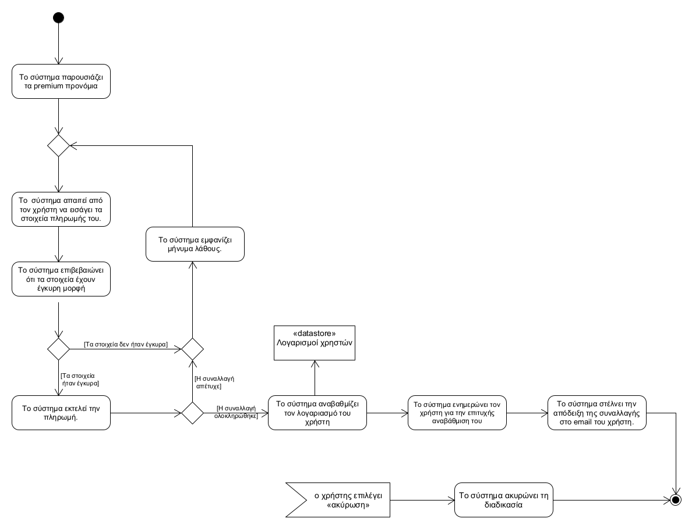

## **Αναβάθμιση σε Premium**
---   
**Πρωτεύον actor:** Χρήστης    
**Ενδιαφερόμενοι:**    
* Χρήστης: Θέλει να αναβαθμίσει τον λογαριασμό του σε premium λογαριασμό.
* Τραπεζικό σύστημα: Εκτελεί τη συναλλαγή.    

**Προϋποθέσεις:**     
* Ο χρήστης να έχει ταυτοποιηθεί επιτυχώς.
* Ο χρήστης δεν έχει premium λογαριασμό.   

### **Βασική ροή**
1) To σύστημα παρουσιάζει στον χρήστη τα προνόμια που προσφέρει η αναβάθμιση του λογαριασμού σε premium
2) Το  σύστημα απαιτεί από τον χρήστη να εισάγει τα στοιχεία πληρωμής του.
3) Το σύστημα επιβεβαιώνει ότι τα στοιχεία έχουν έγκυρη μορφή.
4) Το σύστημα εκτελεί την πληρωμή.
5) Το σύστημα αναβαθμίζει τον λογαριασμό του χρήστη
6) Το σύστημα ενημερώνει τον χρήστη για την επιτυχής αναβάθμιση του λογαριασμού του.
7) Το σύστημα στέλνει την απόδειξη της συναλλαγής στο email του χρήστη.

### **Εναλλακτικές ροές**
*Στα βήματα 1 έως και 4 ο χρήστης επιλέγει «ακύρωση».
1) Η «Αναβάθμιση σε Premium» τερματίζει.
2) Το σύστημα επιστρέφει στην κύρια οθόνη της εφαρμογής.      

*Στα βήματα 1 έως και 4 ο χρήστης κλείνει την εφαρμογή.
1) Η λειτουργία «Αναβάθμιση σε Premium» δεν ολοκληρώνεται.

3α. Τα στοιχεία πληρωμής δεν είχαν έγκυρη μορφή
1) Το σύστημα εμφανίζει μήνυμα λάθους.
2) Το σύστημα επαναλαμβάνει το βήμα 2 της βασικής ροής.        

4α. Η συναλλαγή απέτυχε
1) Το σύστημα εμφανίζει μήνυμα λάθους.
2) Το σύστημα επαναλαμβάνει το βήμα 2 της βασικής ροής.

[Επιστροφή στη λίστα Περιπτώσεων Χρήσης](../software-requirements.md#περιπτώσεις-χρήσης)
    

