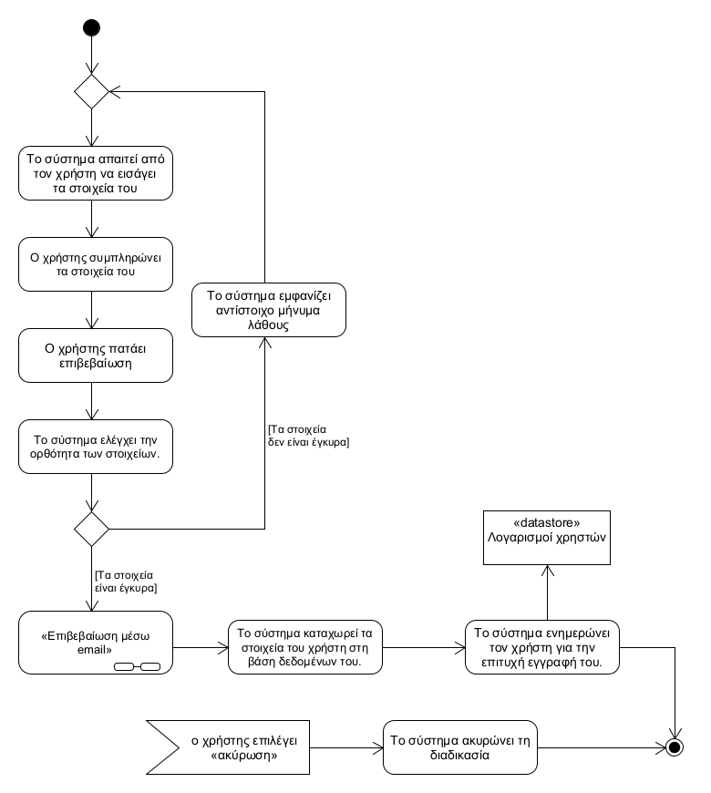
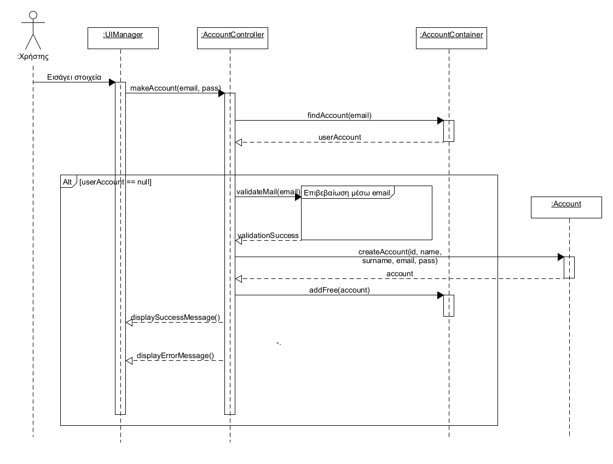

## **Εγγραφή**
---   
**Πρωτεύον actor:** Χρήστης    
**Ενδιαφερόμενοι:**    
* Χρήστης: Θέλει να δημιουργήσει λογαριασμό για να χρησιμοποιήσει την εφαρμογή.   

**Προϋποθέσεις:**     
* Ο χρήστης δεν έχει εγγραφεί ήδη (η διεύθυνση email δεν χρησιμοποιείται ήδη).

### **Βασική ροή**
1) Το σύστημα απαιτεί από τον χρήστη την εισαγωγή του email, του κωδικού, και όλων των άλλων στοιχείων που απαιτούνται για τη δημιουργία του λογαριασμού του 
2) Ο χρήστης συμπληρώνει τα στοιχεία του
3) Ο χρήστης πατάει επιβεβαίωση
4) Το σύστημα ελέγχει την ορθότητα των στοιχείων.
5) Το σύστημα εκτελεί την λειτουργικότητα “Επιβεβαίωση μέσω email”
6) Το σύστημα καταχωρεί τον λογαριασμό του νέου χρήστη.
7) Το σύστημα ενημερώνει τον χρήστη για την επιτυχή εγγραφή του.

### **Εναλλακτικές ροές**
*Στα βήματα 1 έως 5 ο χρήστης επιλέγει «ακύρωση».
1) Η «Εγγραφή» δεν πραγματοποιείται.
2) Το σύστημα επιστρέφει στην οθόνη σύνδεσης.
    
*Σε οποιοδήποτε σημείο ο χρήστης κλείνει την εφαρμογή.
1) Η «Εγγραφή» δεν πραγματοποιείται.

4α. Ο χρήστης δεν υπέβαλε όλα τα απαραίτητα στοιχεία με την απαραίτητη μορφή τους ή ο χρήστης επέλεξε email το οποίο χρησιμοποιείται ήδη 
1) Το σύστημα εμφανίζει αντίστοιχο μήνυμα λάθους.
2) Ο χρήστης παραπέμπεται στο βήμα 1 της βασικής ροής.

[Επιστροφή στη λίστα Περιπτώσεων Χρήσης](../software-requirements.md#περιπτώσεις-χρήσης)
  

  

