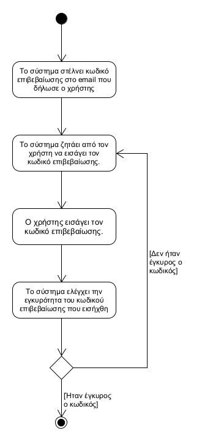
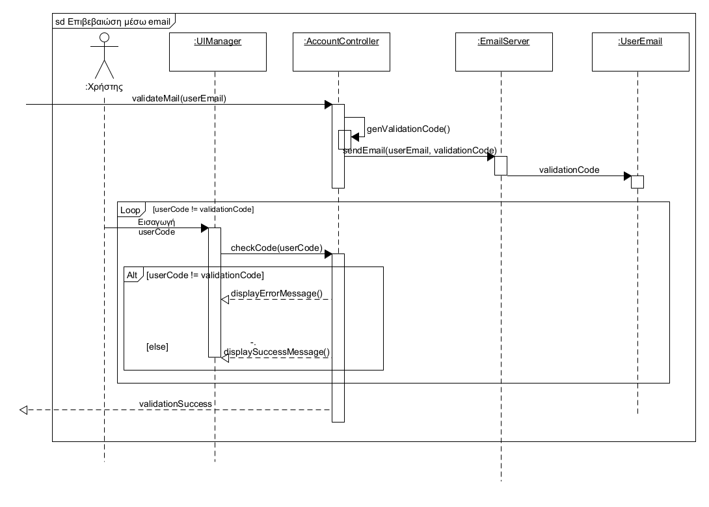

## **Επιβεβαίωση μέσω email**
---   
**Πρωτεύον actor:** Χρήστης    
**Ενδιαφερόμενοι:**    
* Χρήστης: Θέλει να καταχωρήσει κάποιο email.   

**Προϋποθέσεις:**     
* Ο χρήστης έχει κάποιο λογαριασμό email.

### **Βασική ροή**
1) Το σύστημα στέλνει κωδικό επιβεβαίωσης στο email που δήλωσε ο χρήστης.
2) Το σύστημα ζητάει από τον χρήστη να εισάγει τον κωδικό επιβεβαίωσης που του στάλθηκε.
3) Ο χρήστης εισάγει τον κωδικό επιβεβαίωσης.
4) Το σύστημα ελέγχει την εγκυρότητα του κωδικού επιβεβαίωσης που εισήχθη

### **Εναλλακτικές ροές**
4α. Είναι λανθασμένος ο κωδικός επιβεβαίωσης που εισήγαγε ο χρήστης.
1) Το σύστημα εμφανίζει μήνυμα λάθους.
2) Ο χρήστης παραπέμπεται στο βήμα 3 της βασικής ροής.

[Επιστροφή στη λίστα Περιπτώσεων Χρήσης](../software-requirements.md#περιπτώσεις-χρήσης)
  

  

