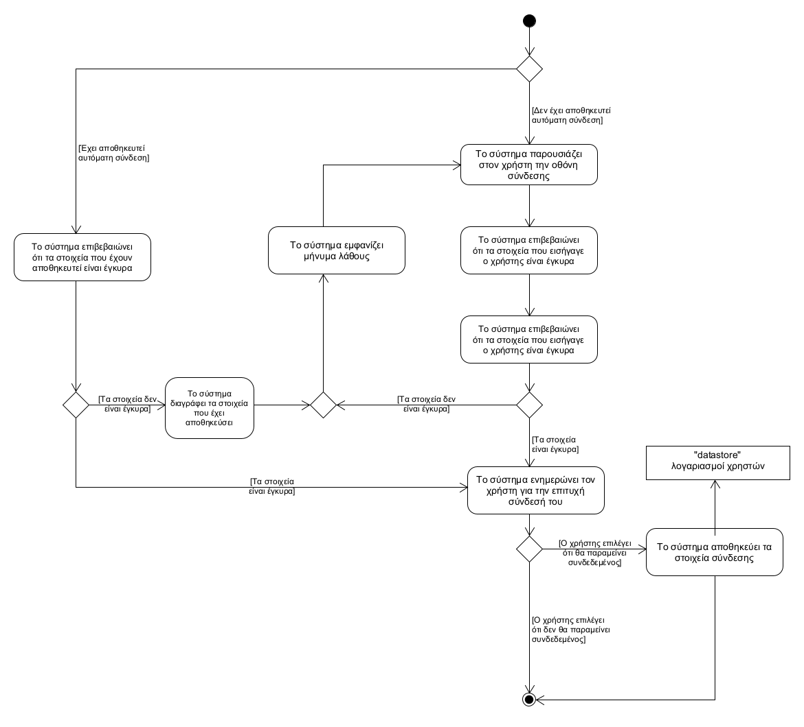
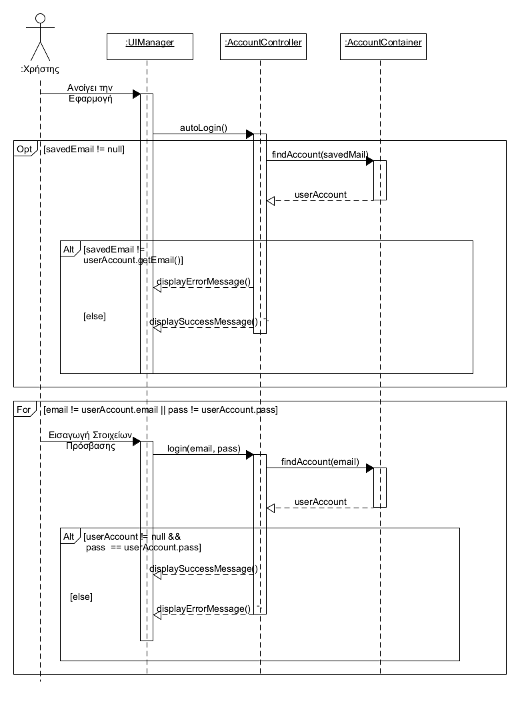

## **Ταυτοποίηση**
---   
**Πρωτεύον actor:** Χρήστης    
**Ενδιαφερόμενοι:**    
* Χρήστης: Θέλει να συνδεθεί λογαριασμό του.    

**Προϋποθέσεις:**     
* Ο χρήστης είναι εγγεγραμμένος στο σύστημα.    

### **Βασική ροή**
1) Το σύστημα ζητάει τα στοιχεία ταυτοποίησης.
2) Ο χρήστης εισάγει τα στοιχεία του λογαριασμού του
3) Το σύστημα επιβεβαιώνει ότι τα στοιχεία που εισήγαγε ο χρήστης είναι έγκυρα
4) Το σύστημα ενημερώνει τον χρήστη για την επιτυχή σύνδεσή του

### **Εναλλακτικές ροές**
*Σε οποιοδήποτε σημείο ο χρήστης κλείνει την εφαρμογή.
1) Η «Ταυτοποίηση» τερματίζει.
     
1α. Ο χρήστης έχει επιλέξει την αυτόματη σύνδεσή του στην εφαρμογή
1) Το σύστημα επιβεβαιώνει ότι τα στοιχεία που έχουν αποθηκευτεί είναι έγκυρα
    * Τα στοιχεία που έχουν αποθηκευτεί στο σύστημα δεν είναι έγκυρα
        1) Το σύστημα ενημερώνει τον χρήστη ότι τα αποθηκευμένα στοιχεία έχουν αλλάξει
        2) Το σύστημα διαγράφει τα στοιχεία που έχει αποθηκεύσει
        3) Το σύστημα επιστρέφει στη βασική ροή της λειτουργίας από το βήμα 2
2) Το σύστημα επιστρέφει στο βήμα 4 της βασικής ροής.

3α. Το στοιχεία που εισήγαγε ο χρήστης δεν είναι έγκυρα
1) Το σύστημα εμφανίζει μήνυμα λάθους.
2) Το σύστημα παραπέμπει τον χρήστη στο βήμα 2 της βασικής ροής.

[Επιστροφή στη λίστα Περιπτώσεων Χρήσης](../software-requirements.md#περιπτώσεις-χρήσης)
  

  

