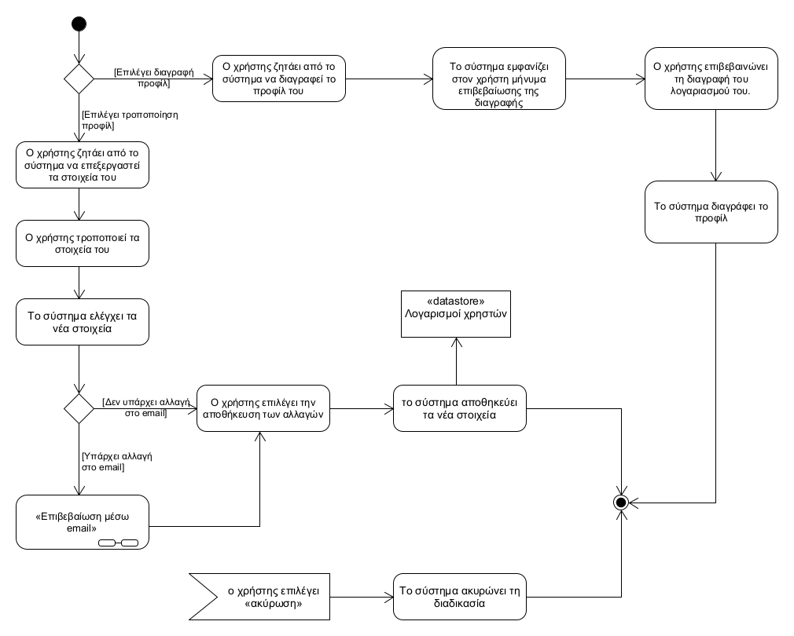
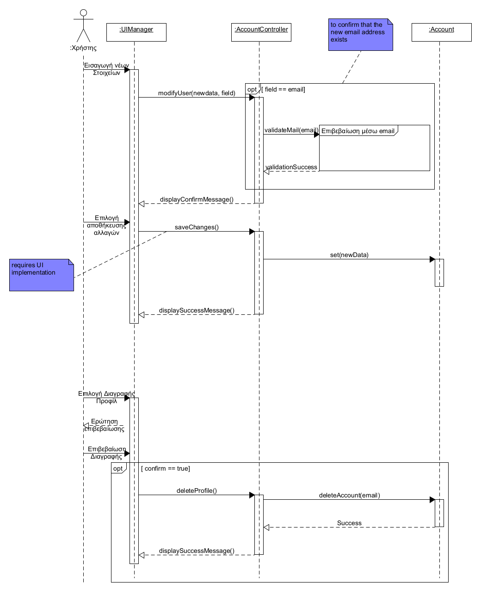

## **Διαχείριση προφίλ χρήστη**
---   
**Πρωτεύον actor:** Χρήστης    
**Ενδιαφερόμενοι:**    
* Χρήστης: θέλει να επεξεργαστεί τον λογαριασμό του.

**Προϋποθέσεις:**     
* Ο χρήστης να είναι εγγεγραμμένος στο σύστημα
* Ο χρήστης να έχει ταυτοποιηθεί επιτυχώς.

### **Βασική ροή**     
<!--***ΤΡΟΠΟΠΟΙΗΣΗ ΠΡΟΦΙΛ:***-->    
1) ο χρήστης ζητάει από το σύστημα να επεξεργαστεί τα στοιχεία του
2) ο χρήστης τροποποιεί τα στοιχεία του
3) το σύστημα ελέγχει τα νέα στοιχεία
4) ο χρήστης επιλέγει την αποθήκευση των αλλαγών
5) το σύστημα αποθηκεύει τα νέα στοιχεία

### **Εναλλακτικές ροές**     
*Στα βήματα 2 ή 3 ο χρήστης επιλέγει την ακύρωση των αλλαγών
1) Tο σύστημα δεν αποθηκεύει τις αλλαγες
2) Tο σύστημα επιστρέφει στην κύρια οθόνη της εφαρμογής

3α. Σε περίπτωση αλλαγής email 
1) Εκτελείται η λειτουργικότητα του “Επιβεβαίωση μέσω email”
2) To σύστημα παραπέμπει τον χρήστη στο βήμα 4 της βασικής ροης.
  

***Διαγραφή Προφίλ:*** 
1) O χρήστης ζητάει την διαγραφή του προφίλ του.
2) Tο σύστημα εμφανίζει στον χρήστη μήνυμα επιβεβαίωσης της διαγραφής. 
3) Ο χρήστης επιβεβαινώνει τη διαγραφή του λογαριασμού του.
4) Tο σύστημα διαγράφει το προφίλ.

### **Εναλλακτικές ροές**     
3α. Ο χρήστης επιλέγει να ακυρώσει τη διαγραφή
1) Tο σύστημα επιστρέφει στην κύρια οθόνη της εφαρμογής

[Επιστροφή στη λίστα Περιπτώσεων Χρήσης](../software-requirements.md#περιπτώσεις-χρήσης)
  

  

