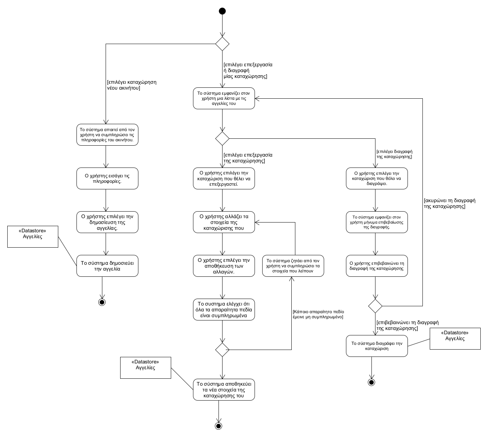

## **Διαχείριση αγγελίας ακινήτου**
---   
**Πρωτεύον actor:** Χρήστης    
**Ενδιαφερόμενοι:**    
* Χρήστης: Θέλει να τροποποιήσει μια καταχώρησή του.    

**Προϋποθέσεις:**     
* Ο χρήστης να έχει ταυτοποιηθεί επιτυχώς.
* Να υπάρχει η καταχώριση που θέλει να τροποποιήσει/διαγράψει,     

### **Βασική ροή**
<!--***Δημιουργία αγγελίας:***-->    
1) Ο χρήστης επιλέγει να καταχωρήσει νέα αγγελία.
2) Το σύστημα παρουσιάζει στον χρήστη τα πεδία που πρέπει να συμπληρώσει με πληροφορίες του ακινήτου.
3) Ο χρήστης εισάγει τις πληροφορίες.
4) Ο χρήστης επιλέγει την δημοσίευση της αγγελίας.
5) Το σύστημα δημοσιεύει την αγγελία

### **Εναλλακτικές ροές:**    
*Στα βήματα 2 έως 4. Ο χρήστης επιλέγει την ακύρωση της διαδικασίας.
1) Το σύστημα παρουσιάζει στον χρήστη το αρχικό μενού της εφαρμογής
  

***Τροποποίηση αγγελίας:***
1) Το σύστημα εμφανίζει στον χρήστη μια λίστα με τις αγγελίες του.
2) Ο χρήστης επιλέγει την καταχώριση που θέλει να επεξεργαστεί
3) Ο χρήστης αλλάζει τα στοιχεία της καταχώρισης που επέλεξε
4) Ο χρήστης επιλέγει την αποθήκευση των αλλαγών
5) Το συστημα ελέγχει ότι όλα τα απαραίτητα πεδία είναι συμπληρωμένα
6) Το σύστημα αποθηκεύει τα νέα στοιχεία της καταχώρησης του χρήστη

5α. Κάποιο απαραίτητο πεδίο έμεινε μη συμπληρωμένο
1) Το σύστημα ζητάει από τον χρήστη να το συμπληρώσει
2) ο σύστημα παραπέμπει τον χρήστη στο βήμα 3 της βασικής ροής
  

***Διαγραφή αγγελίας:***
1) Το σύστημα εμφανίζει στον χρήστη μια λίστα με τις αγγελίες του.
2) Ο χρήστης επιλέγει την καταχώριση που θέλει να διαγράψει.
3) Το σύστημα εμφανίζει στον χρήστη μήνυμα επιβεβαίωσης της διαγραφής. 
4) Ο χρήστης επιβεβαινώνει τη διαγραφή της καταχώρησης
5) Το σύστημα διαγράφει την καταχώριση

   
4α. Ο χρήστης επιλέγει να ακυρώσει τη διαγραφή
1) Tο σύστημα επαναλαμβάνει το βήμα 1 της κύριας ροής

<!-- δεν πρέπει να πούμε να τερματίζει με κάποιο τρόπο την λειτουργία; -->

[Επιστροφή στη λίστα Περιπτώσεων Χρήσης](../software-requirements.md#περιπτώσεις-χρήσης)
   

