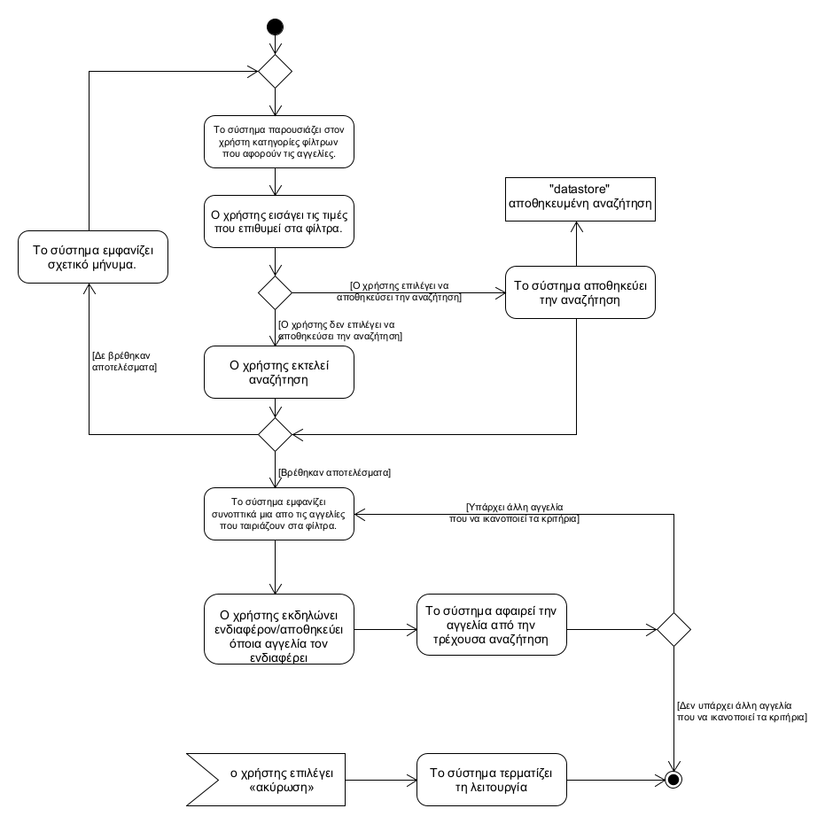
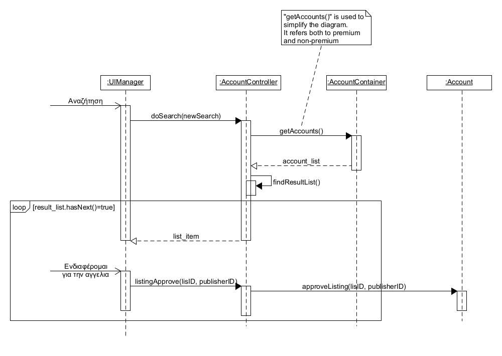

## **Αναζήτηση Ακινήτου**
---   
**Πρωτεύον actor:** Χρήστης    
**Ενδιαφερόμενοι:**    
* Χρήστης:  Θέλει να δει ακίνητα που ικανοποιούν τις ανάγκες του. 

**Προϋποθέσεις:**     
* Ο χρήστης να έχει ταυτοποιηθεί επιτυχώς.

### **Βασική ροή**
1) Το σύστημα παρουσιάζει στον χρήστη κατηγορίες φίλτρων που αφορούν τις αγγελίες.
2) Ο χρήστης εισάγει τις τιμές που επιθυμεί στα φίλτρα.
3) Ο χρήστης εκτελεί αναζήτηση
4) Το σύστημα εμφανίζει συνοπτικά μια απο τις αγγελίες που ταιριάζουν στα φίλτρα.
5) Ο χρήστης εκδηλώνει ενδιαφέρον / αποθηκεύει όποια αγγελία τον ενδιαφέρει
6) Το σύστημα αφαιρεί την αγγελία από την τρέχουσα αναζήτηση
7) Το σύστημα επαναλαμβάνει τα βήματα 4 έως 6 μέχρι να τερματίσει ο χρήστης τη λειτουργία.

### **Εναλλακτικές ροές**
*Σε οποιοδήποτε σημείο της διαδικασίας ο χρήστης επιλέγει να αποθηκεύει την αναζήτηση του.
1) Το σύστημα αποθηκεύει τα κριτήρια της αναζήτησης

*Σε οποιοδήποτε σημείο της διαδικασίας ο χρήστης τερματίζει τη λειτουργία.
1) Το σύστημα επιστρέφει στην αρχική οθόνη της εφαρμογής.

4α. Δεν υπάρχουν αποτελέσματα που να ταιριάζουν με τα φίλτρα που επέλεξε ο χρήστης.
1) Το σύστημα εμφανίζει σχετικό μήνυμα.
2) Το σύστημα επιστρέφει στο βήμα 1 της βασικής ροής.

[Επιστροφή στη λίστα Περιπτώσεων Χρήσης](../software-requirements.md#περιπτώσεις-χρήσης)
  

  

