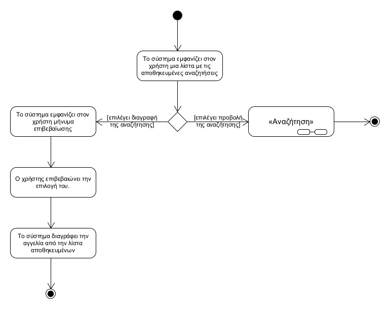
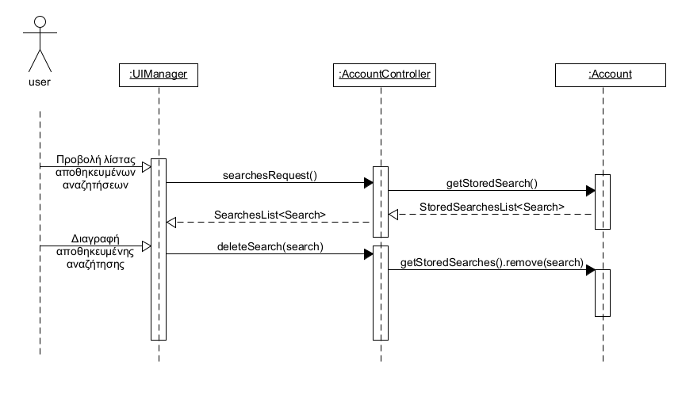

## **Διαχείριση αποθηκευμένων αναζητήσεων**
---   
**Πρωτεύον actor:** Χρήστης    
**Ενδιαφερόμενοι:**    
* Χρήστης: Θέλει να επεξεργαστεί τις αποθηκευμένες αναζητήσεις του.   

**Προϋποθέσεις:**     
* Ο χρήστης να έχει ταυτοποιηθεί επιτυχώς.
* Ο χρήστης να έχει αποθηκεύσει κάποια αναζήτηση.  

### **Βασική ροή**
1) Το σύστημα εμφανίζει στον χρήστη μια λίστα με τις αποθηκευμένες αναζητήσεις του
2) Ο χρήστης επιλέγει μια αναζήτηση προς προβολή
3) Το σύστημα παραπέμπει τον χρήστη στην λειτουργικότητα “Αναζήτηση”, στο βήμα 3 της βασικής ροής.

### **Εναλλακτικές ροές**
2α. Ο χρήστης επιλέγει μια αναζήτηση προς διαγραφή.
1) Το σύστημα εμφανίζει στον χρήστη μήνυμα επιβεβαίωσης της διαγραφής.
2) Ο χρήστης επιβεβαιώνει την επιλογή του.
3) Το σύστημα διαγράφει την αναζήτηση από την λίστα αποθηκευμένων αναζήτηση.

[Επιστροφή στη λίστα Περιπτώσεων Χρήσης](../software-requirements.md#περιπτώσεις-χρήσης)
  

  

