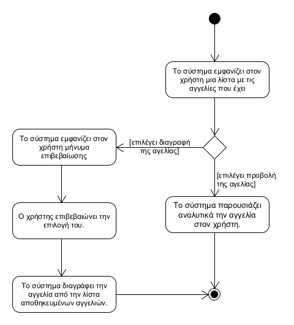

## **Διαχείριση αποθηκευμένων αγγελιών**
---   
**Πρωτεύον actor:** Χρήστης    
**Ενδιαφερόμενοι:**    
* Χρήστης: Θέλει να επεξεργαστεί τις αποθηκευμένες αγγελίες του.   

**Προϋποθέσεις:**     
* Ο χρήστης να έχει ταυτοποιηθεί επιτυχώς.
* Ο χρήστης να έχει αποθηκεύσει κάποια αγγελία.  

### **Βασική ροή**
1) Το σύστημα εμφανίζει στον χρήστη μια λίστα με τις αγγελίες που έχει αποθηκεύσει 
2) Ο χρήστης επιλέγει μια αποθηκευμένη αγγελία προς προβολή
3) Το σύστημα παρουσιάζει αναλυτικά την αγγελία στον χρήστη.

### **Εναλλακτικές ροές**
2α. Ο χρήστης επιλέγει μια αποθηκευμένη αγγελία προς διαγραφή.
1) Το σύστημα εμφανίζει στον χρήστη μήνυμα επιβεβαίωσης της διαγραφής.
2) Ο χρήστης επιβεβαιώνει την επιλογή του.
3) Το σύστημα διαγράφει την αγγελία από την λίστα αποθηκευμένων αγγελιών.

[Επιστροφή στη λίστα Περιπτώσεων Χρήσης](../software-requirements.md#περιπτώσεις-χρήσης)
  

