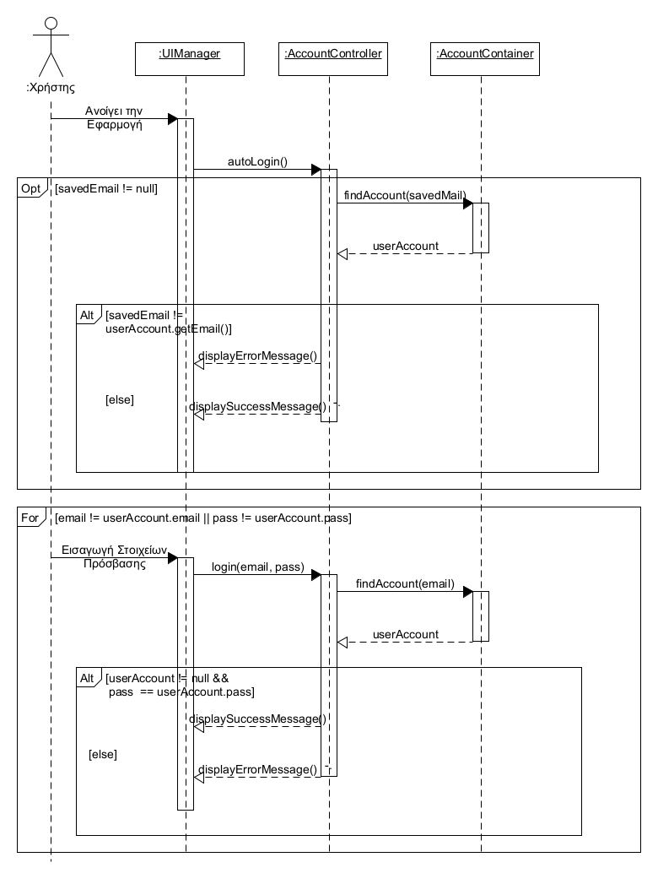
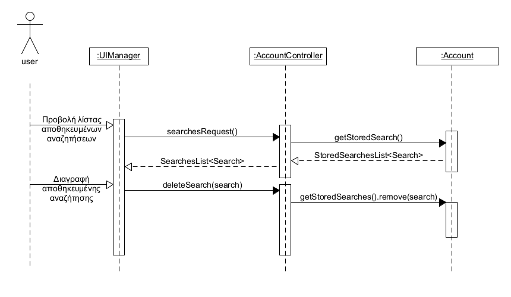

# Design diagrams

### **To domain model του συστήματος είναι:**    

### **To class diagram του συστήματος είναι:**    

### **To διάγραμμα ακολουθίας της εγγραφής είναι:**    

### **To διάγραμμα ακολουθίας της σύνδεσης του χρήστη στην εφαρμογή είναι:**    

### **To διάγραμμα ακολουθίας της επεξεργασίας του προφίλ του χρήστη είναι:**    

### **To διάγραμμα ακολουθίας της επιβεβαιώσης μέσω email είναι:**    

### **To διάγραμμα ακολουθίας της διαχείρισης των αποθηκευμένων αναζήτησεων του χρήστη είναι:**    

### **To διάγραμμα ακολουθίας της αναζήτησης είναι:**    

### **To coverage report των unit tests είναι:**    

