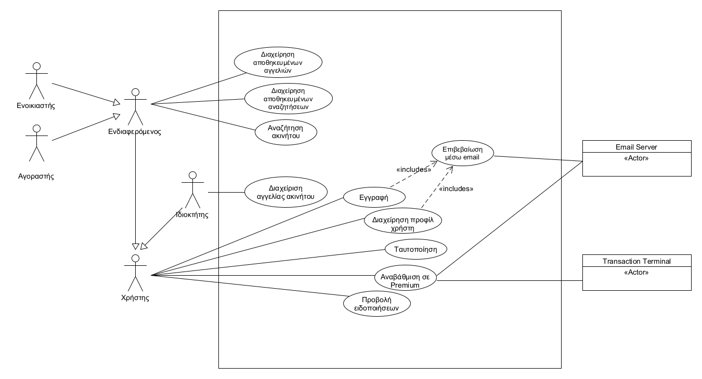
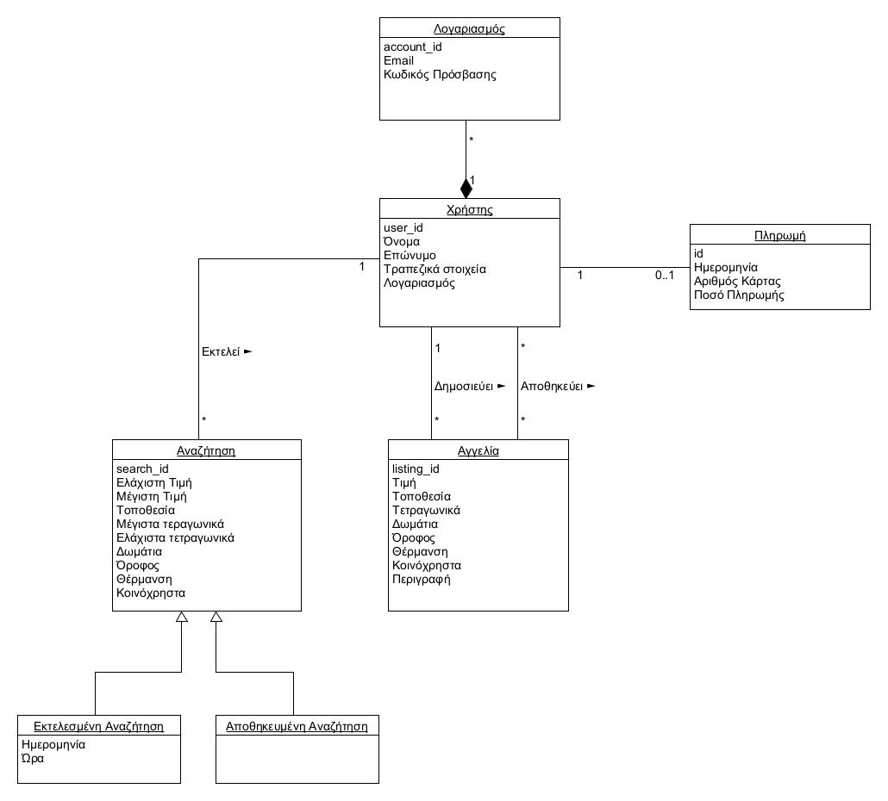
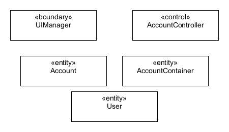

# Εισαγωγή

\[*Μία εισαγωγή που αφορά το παρόν έγγραφο.*\]

## Εμβέλεια

\[*Περιγράφουμε τι θα κάνει και κυρίως τι δεν θα κάνει το λογισμικό. Βλέπε παράδειγμα 3-2 του βιβλίου στη σελίδα 139.* 
Το λογισμικό εξυπηρετεί δυο σκοπούς. Εξυπηρετεί την ανάγκη κάποιων χρηστών που σχετίζεται με ευρέση ακίνητων. Επίσης, εξυπηρετεί την ανάγκη κάποιων ιδιοκτητών να προβάλλουν τα σπίτια τους σε πιθανούς ενδιαφερόμενους. 

*Ένα διάγραμμα περιβάλλοντος (πρωταρχικό διάγραμμα ροής δεδομένων) που βοηθά στην κατανόηση του συστήματος σε σχέση με το περιβάλλον του. Βλέπε το σχήμα 4-12 του παραδείγματος 4-1 στη σελίδα 185 του βιβλίου*\]

# Συνολική περιγραφή

## Επισκόπηση μοντέλου περιπτώσεων χρήσης

# Ειδικές Απαιτήσεις 
## Περιπτώσεις χρήσης
------
* [Εγγραφή](UseCases/uc1-sign_up.md)
* [Ταυτοποίηση](UseCases/uc2-login.md)
* [Διαχείριση προφίλ χρήστη](UseCases/uc3-edit_profile.md)
* [Διαχείριση αγγελίας ακινήτου](UseCases/uc4-listing_edit.md)
* [Αναβάθμιση σε Premium](UseCases/UC5.md)
* [Προβολή ειδοποιήσεων](UseCases/uc6-view-notifications.md)
* [Αναζήτηση Ακινήτου](UseCases/uc7-search.md)
* [Διαχείριση αποθηκευμένων αναζητήσεων](UseCases/uc8-manage-saved-searches.md)
* [Διαχείριση αποθηκευμένων αγγελιών](UseCases/uc9-manage-saved-listings.md)
* [Επιβεβαίωση μέσω email](UseCases/uc10-confirm-mail.md)
  

## Συμπληρωματικές προδιαγραφές

Οι επόμενες ενότητες περιέχουν όλες τις μη λειτουργικές απαιτήσεις και τους περιορισμούς σχεδίασης και υλοποίησης.

### Απαιτήσεις διεπαφών

#### Διεπαφές χρήστη
Σε όλες τις οθόνες που βλέπει ο χρήστης θα υπάρχει συνέπεια ως προς την διάταξη των στοιχείων της διεπαφής. 
Σε όλες τις οθόνες που βλέπει ο χρήστης θα υπάρχει συνέπεια ως προς τον χρωματισμό των στοιχειών της διεπαφής. 
Τα στοιχεία της διεπαφής θα προσαρμόζονται δυναμικά στις διαστάσεις της οθόνης της συσκευής.

#### Διεπαφές υλικού
Η εφαρμογή χρησιμοποιεί τους αισθητήρες της συσκευής.

#### Διεπαφές επικοινωνίας
\[*Βλέπε πίνακα 5-2 του παραδείγματος 5-1 στη σελίδα 305*\]

#### Διεπαφές λογισμικού

### Περιορισμοί σχεδίασης και υλοποίησης
Κάθε διεύθυνση email δεν μπορεί να χρησιμοποιηθεί πάνω από μια φορά.

### Ποιοτικά χαρακτηριστικά

#### Απόδοση
To σύστημα πρέπει να ανταποκρίνεται σε εύλογο χρόνο.

#### Διαθεσιμότητα
Το σύστημα πρέπει να λειτουργεί αδιάλειπτα καθόλη την διάρκεια της ημέρας. 
Για την πλήρη λειτουργεία της εφαρμογής είναι απαραίτητη η σύνδεση στο διαδίκτυο. 

#### Ασφάλεια
Το σύστημα εφαρμόζει τεχνικές κρυπτογράφησης στα δεδομένα των χρηστών του. 
Το σύστημα δεν αποθηκεύει τα στοιχεία της κάρτας με την οποία ο χρήστης διεκπεραιωνεί την πληρωμή του.  

#### Ευελιξία
Η εφαρμογή θα είναι συμβατή με παλαιότερες εκδόσεις του Android.

#### Ευχρηστία
Τα στοιχεία της επαφής θα έχουν ευδιάκριτες ετικέτες. 
Όλα τα στοιχεία κειμένου θα αναγράφονται με κάποια γραμματοσειρά της οικογένειας Sans Serif.

# Υποστηρικτικό υλικό

## Μοντέλο πεδίου

## Ανάλυση περιπτώσεων χρήσης
--------------------------

### Κλάσεις ανάλυσης

\[*Εισάγουμε ένα διάγραμμα κλάσεων με την αρχική έκδοση των κλάσεων λογισμικού. Βλέπε σχήμα 4-104 του παραδείγματος 4-14 στη σελίδα 258 του βιβλίου*\]

Κλάσεις ανάλυσης που έχουν προκύψει από την ανάλυση των περιπτώσεων χρήσης.

### Συμπεριφορές

\[*Για κάθε σημαντική περίπτωση χρήσης εισάγουμε ένα διάγραμμα κλάσεων με τις κλάσεις που συμμετέχουν στη συμπεριφορά του συστήματος για την περίπτωση χρήσης. Το σημαντικότερο όμως είναι ένα διάγραμμα επικοινωνίας ή ακολουθίας που δείχνει την ανταλλαγή μηνυμάτων.*

*Βλέπε το παράδειγμα 4-16 στη σελίδα 262 του βιβλίου*\]

## Άλλα μοντέλα
------------

\[*Άλλα μοντέλα όπως για παράδειγμα διαγράμματα μηχανής καταστάσεων, πίνακες απόφασης κλπ. Βλέπε παράδειγμα 4-6 του βιβλίου*\]

## Επιχειρησιακοί κανόνες
